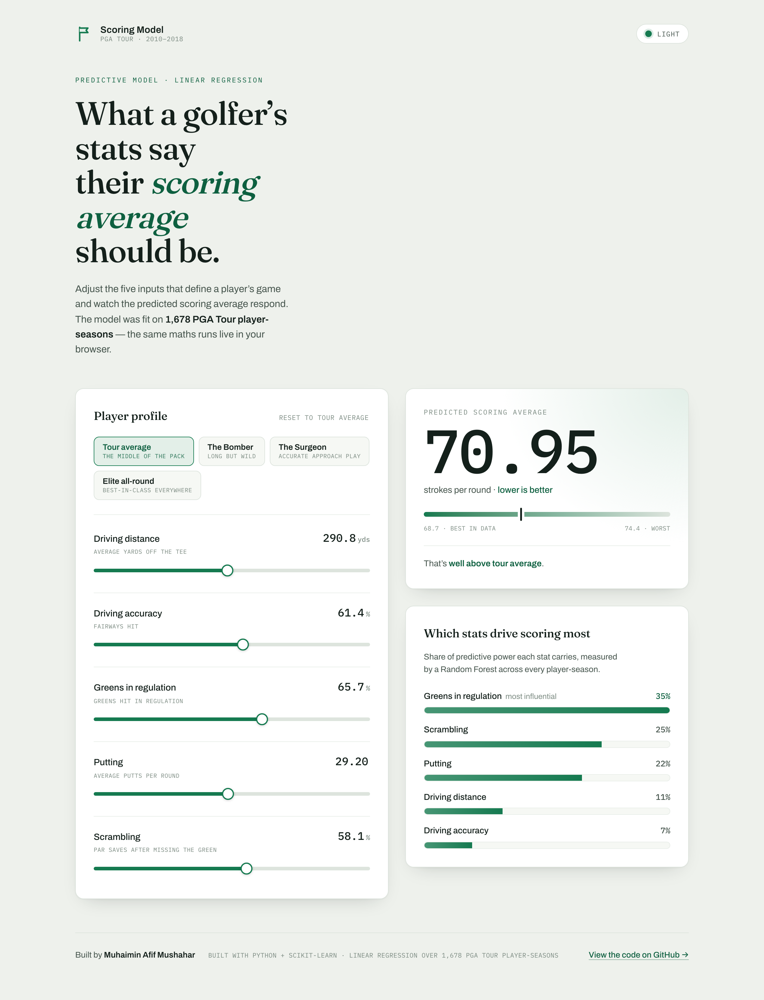

# Golf Scoring Model

Predict a PGA Tour player's **scoring average** from five performance stats —
and see which parts of the game drive scoring the most.

**[▶ Live demo](https://mpip0505.github.io/golf-score-predictor/)** · built with Python, pandas, scikit-learn & Streamlit



---

## What it does

Give the model a player's driving distance, driving accuracy, greens in
regulation, putting, and scrambling, and it predicts their scoring average for
the season. It was trained on **1,678 PGA Tour player-seasons (2010–2018)**.

There are two ways to use it:

- **A static web app** (`web/`) — a polished, phone-friendly page where you
  drag sliders and watch the prediction update live. The trained model is small
  enough to run entirely in the browser, so there's no server. **This is the
  [live demo](https://mpip0505.github.io/golf-score-predictor/).**
- **A Streamlit app** (`app.py`) — the same predictor, running the real Python
  model directly.

## What I learned (the interesting bit)

I trained two models and compared them honestly instead of assuming the fancier
one would win:

| Model | R² (5-fold CV) | RMSE |
|---|---|---|
| **Linear Regression** | **0.678 ± 0.056** | **0.391 strokes** |
| Random Forest | 0.619 ± 0.049 | 0.427 strokes |

The **Random Forest overfit** — it nearly memorised the training data (train
R² 0.945) but did *worse* on unseen players than the simple Linear Regression
baseline, which won all 5 cross-validation folds. A more complex model isn't
automatically better; it has to earn its complexity. Full write-up in
**[`FINDINGS.md`](FINDINGS.md)**.

The feature importances also line up with real golf analytics — *"drive for
show, putt/approach for dough"*:

| Stat | Share of predictive power |
|---|---|
| Greens in regulation | 35% |
| Scrambling | 25% |
| Putting | 22% |
| Driving distance | 11% |
| Driving accuracy | 7% |

## Tech stack

Python · pandas · scikit-learn · Streamlit · vanilla HTML/CSS/JS (no framework)

## Project structure

```
├── data/pgaTourData.csv        # PGA Tour player-season stats, 2010–2018
├── 01_explore_data.py          # Phase 1 — load & summarise the data
├── 02_clean_data.py            # Phase 2 — clean, pick features & target
├── 03_train_baseline.py        # Phase 3 — Linear Regression baseline
├── 04_train_random_forest.py   # Phase 4 — Random Forest + overfitting check
├── 05_cross_validation.py      # Phase 4.5 — 5-fold cross-validation
├── app.py                      # Streamlit app (runs the real Python model)
├── web/                        # Static web app (browser-only, deployed to Pages)
│   ├── index.html
│   ├── styles.css
│   └── predictor.js            # the trained model, ported to JavaScript
├── FINDINGS.md                 # detailed results & interpretation per phase
└── requirements.txt
```

The numbered scripts build the project up phase by phase — run them in order to
follow the same path from raw CSV to trained model.

## Run it locally

### The web app (no Python needed)

```bash
python3 -m http.server 8000 --directory web
# then open http://localhost:8000
```

Or just open `web/index.html` directly in your browser.

### The Python side (phase scripts + Streamlit)

```bash
python3 -m venv venv
source venv/bin/activate          # Windows: venv\Scripts\activate
pip install -r requirements.txt

python 01_explore_data.py         # run any phase script
streamlit run app.py              # launch the Streamlit app
```

## How the prediction works

The model is a linear regression, which is just a weighted sum of the inputs:

```
predicted_score = intercept + Σ (weight_i × stat_i)
```

Because that's plain arithmetic, the coefficients learned in Python are copied
into `web/predictor.js` and produce the *exact same* prediction in the browser.

## Deploying to GitHub Pages

The included workflow (`.github/workflows/deploy-pages.yml`) publishes the
`web/` folder automatically. One-time setup: **Settings → Pages → Source →
"GitHub Actions"**. After that, every push to `main` redeploys the live demo.

## Data

`data/pgaTourData.csv` — public PGA Tour performance statistics, 2010–2018
(one row per player per season).

## License

[MIT](LICENSE) © Muhaimin Afif Mushahar
